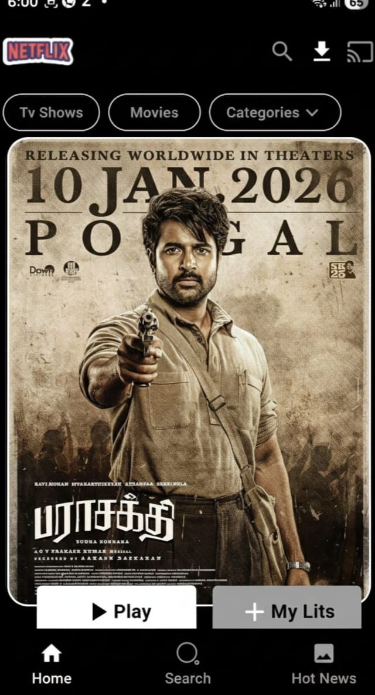
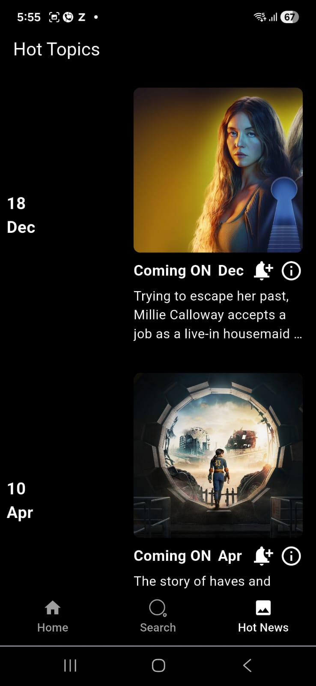

# Netflix Clone - Flutter App

A simple Netflix clone app built with **Flutter** to replicate the user interface and basic functionality of the Netflix app.

## Features

- **Home Screen**: Displays movie and TV show categories such as Trending, Top Picks, and New Releases.
- **Movie Details**: Click on any movie or TV show to view detailed information.
- **Search**: Search for movies and shows.

## Technologies Used

- **Flutter**: For the development of the mobile app.
- **Dart**: Programming language for Flutter.
- **API Integration**: The app uses APIs (e.g., The Movie Database API) to fetch movie data.

## Setup Instructions

### Prerequisites

1. Install **Flutter** on your machine. If you haven't, follow the instructions on the official Flutter website: [Flutter Install Guide](https://flutter.dev/docs/get-started/install).
2. Ensure **Android Studio** or **VS Code** is set up for Flutter development.

### Clone the Repository

```bash
git clone https://github.com/your-username/netflix-clone.git
cd netflix-clone
Install Dependencies
flutter pub get

Run the App
flutter run

pubspec.yaml Dependencies

Here are the dependencies you've used for the project, listed under pubspec.yaml:

dependencies:
  flutter:
    sdk: flutter
  cupertino_icons: ^1.0.8
  lottie: ^3.1.1
  iconsax: ^0.0.8
  http: ^1.0.0
  cached_network_image: ^3.1.0
  intl: ^0.19.0
```
## Screenshots







